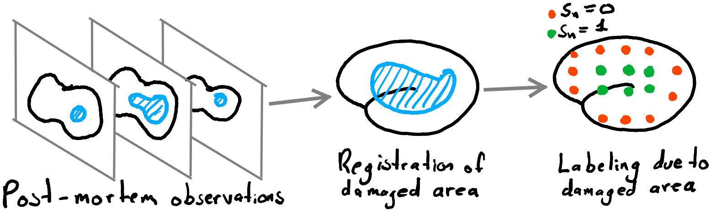

# Electric Source Imaging with Dicotomic Region Priors

This is part of my PhD dissertation. As a work in progress, full documentation is yet to be added.

In lieu of proper documentation, [in this link](https://drive.google.com/file/d/1LCpD2tslWJpND0sAfV79QxPZMI9IVbSK/view?usp=sharing) you can find some slides used to present this project.

_A grosso modo_ we construct the spatial priors based on observations from low-resolution imaging modalities; for instance, we use pictures from post-mortem staining.

